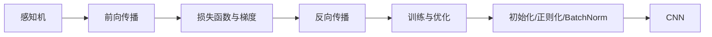

# 学习地图

## 主线

1. [[concepts/感知机|感知机]]：从逻辑门理解“权重 + 偏置 + 阈值”。
2. [[concepts/神经网络前向传播|神经网络前向传播]]：引入激活函数、矩阵运算和多层网络。
3. [[concepts/损失函数与梯度|损失函数与梯度]]：明确学习目标和参数更新方向。
4. [[concepts/误差反向传播|误差反向传播]]：把梯度从“可算”变成“高效可算”。
5. [[concepts/训练循环与优化器|训练循环与优化器]]：把训练组织成可迭代实验。
6. [[concepts/权重初始化与正则化|权重初始化与正则化]] 与 [[concepts/Batch Normalization|Batch Normalization]]：解决深层训练不稳定与过拟合。
7. [[concepts/卷积神经网络|卷积神经网络]]：把模型扩展到图像局部结构。

## 与仓库内容的对应

- 书籍主线来自 [[summaries/fish-book-pdf|鱼书 PDF]]。
- 学习路径说明来自 [[summaries/fish-book-repo-overview|仓库总览]]。
- 具体实验来自 [[summaries/fish-book-examples|示例与练习]]。

## 推荐阅读顺序

- 代码导向：`t01 -> t02 -> t03 -> t05 -> t06/t07 -> t08...t21`
- 理论导向：第 2 章 -> 第 3 章 -> 第 4 章 -> 第 5 章 -> 第 6 章 -> 第 7 章
- 实现导向：[[entities/MNIST|MNIST]] -> [[entities/NeuralNet|NeuralNet]] -> [[entities/Trainer|Trainer]] -> [[entities/SimpleConvNet|SimpleConvNet]]

## 覆盖边界

- 第 1 章和第 8 章主要由 PDF 提供主题线索。
- 第 2 章到第 7 章在 `raw/code/` 中有明确的实现或实验支撑。

## 学习图

