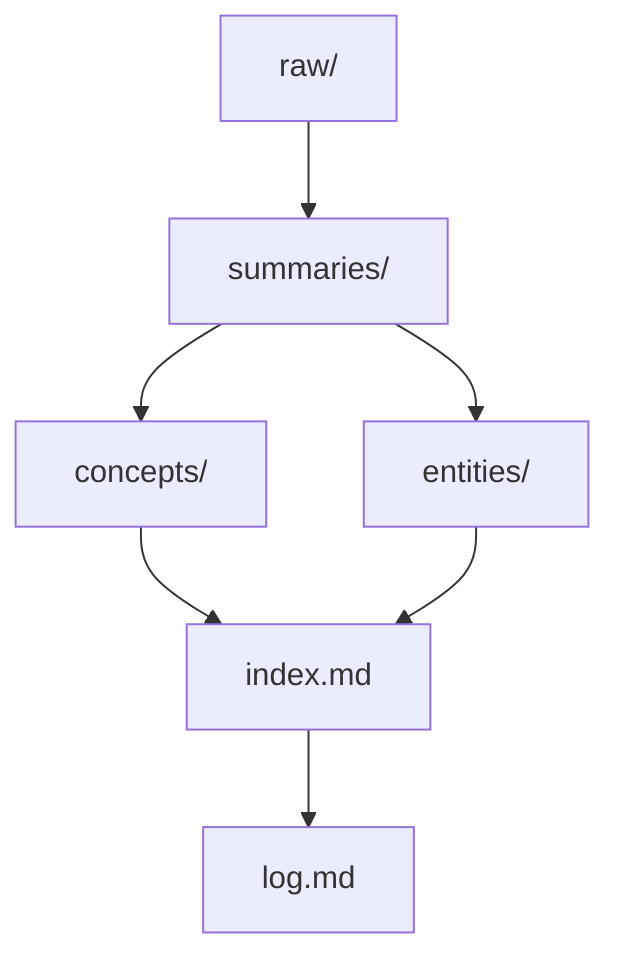

# 知识库组织原则

## 本库采用的组织方式

- `summaries/`：面向来源，回答“原始材料说了什么”。
- `concepts/`：面向主题，回答“这些来源合起来说明了什么”。
- `entities/`：面向稳定对象，回答“哪些人、书、数据集、类值得单独追踪”。
- `index.md`：总入口。
- `log.md`：维护轨迹。

## 为什么这样分

- 鱼书资料横跨 PDF、README、脚本、notebook、代码模块，单一目录很快会失控。
- 概念和来源分层后，可以避免“某个 notebook = 某个概念”的一对一绑定。
- 实体页让 `MNIST`、`NeuralNet`、`Trainer` 这种跨多页反复出现的对象有稳定落点。

## 当前仓库的特殊约束

- 采用 skill 推荐的三层结构。
- 同时保留单文件 `[[log]]`，不拆成日期目录。
- 所有页面尽量交叉链接，避免孤立。

## 结构图

## 相关页面

- [[summaries/karpathy-llm-wiki-gist|Karpathy 的 llm-wiki gist]]
- [[summaries/lewislulu-llm-wiki-skill|Lewislulu 的 llm-wiki-skill]]
