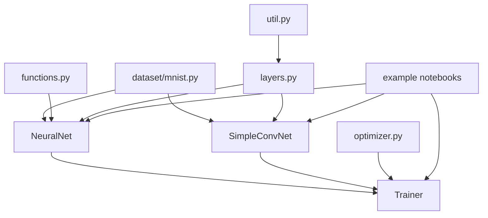

# 鱼书代码架构

## 总体关系

## 分层理解

- `dataset/`：解决“数据从哪里来、长什么样”。
- `libs/functions.py`：解决“基础数学操作”。
- `libs/layers.py`：解决“前向/反向传播的局部规则”。
- `libs/network.py`：解决“如何把层组装成可训练网络”。
- `libs/optimizer.py`：解决“参数如何更新”。
- `libs/trainer.py`：解决“训练流程如何运转”。
- `example/`：解决“如何把这些组件串成实验”。

## 最重要的设计优点

- 抽象清楚，适合教学。
- 前向与反向逻辑在层内部闭合，方便验证。
- `Trainer` 与 `Optimizer` 解耦，便于做实验对比。
- `NeuralNet` 与 `SimpleConvNet` 共用训练流程，说明接口设计足够统一。

## 相关页面

- [[entities/NeuralNet|NeuralNet]]
- [[entities/Trainer|Trainer]]
- [[entities/SimpleConvNet|SimpleConvNet]]
- [[summaries/fish-book-core-implementation|核心实现]]
